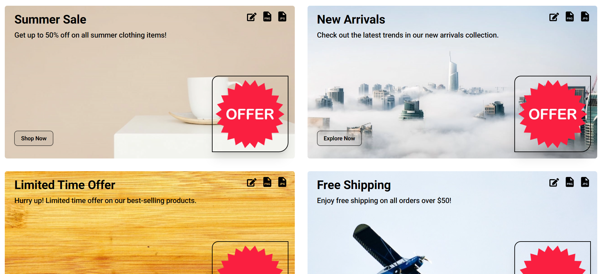

# Eye-Catcher

Eye-Catcher is a web application designed to create stunning banners for social media. With Eye-Catcher, you can edit, upload your images via file selection or URLs, and download your banners in JPG and PNG formats with just a click.

## Features

- Create beautiful banners for social media
- Edit banner details including title, description, and call to action
- Upload images from your computer or use image URLs
- Download banners in JPG and PNG formats
- Predefined images to choose from
- Responsive and user-friendly interface
- Real-time banner preview

## Technologies Used

- **React**: A JavaScript library for building user interfaces.
- **Next.js**: A React framework for building server-rendered applications with optimized performance and SEO.
- **Tailwind CSS**: A utility-first CSS framework for rapidly building custom user interfaces.
- **TypeScript**: A typed superset of JavaScript that compiles to plain JavaScript, providing enhanced code quality and developer experience.
- **react-icons**: A collection of popular icons to use as React components.
- **html2canvas**: A library to capture and create screenshots of web pages or parts of them as canvas elements.

## How to Install and Run Locally

This project is built with Next.js. Follow the steps below to install and run the project locally:

1. **Clone the repository:**

   ```bash
   git clone https://github.com/amankashyap004/eye-catcher.git
   cd eye-catcher
   ```

2. **Install dependencies:**

   ```bash
   npm install
   ```

3. **Run the development server:**
   ```bash
   npm run dev
   ```
   Open [http://localhost:3000](http://localhost:3000) with your browser to see the result.

## Screenshots



## Live Demo

Check out the live demo **[Here](https://eye-catcher.vercel.app/)**.

## Folder Structure

```
EYE-CATCHER/
├── .next/
├── node_modules/
├── public/
│ ├── images/
│ │ ├── all images
├── src/
│ ├── app/
│ │ ├── favicon.ico
│ │ ├── globals.css
│ │ ├── layout.tsx
│ │ └── page.tsx
│ ├── components/
│ │ ├── BannerImageComponent.tsx
│ │ ├── BannerPreview.tsx
│ │ ├── EditBannerTemplate.tsx
│ ├── mock/
│ │ ├── database.json
│ │ └── predefinedImages.json
├── .eslintrc.json
├── .gitignore
├── next.config.mjs
├── package-lock.json
├── package.json
├── postcss.config.mjs
├── README.md
├── tailwind.config.ts
└── tsconfig.json
```

## Future Enhancements

- Add more banner templates with different styles
- Implement user authentication and save user data
- Integrate backend services and manage data in a database
- Enhance the user interface and experience
- Integrate AI to provide smart design suggestions

Feel free to contact me for any queries or suggestions.
